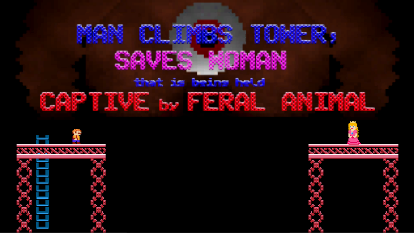
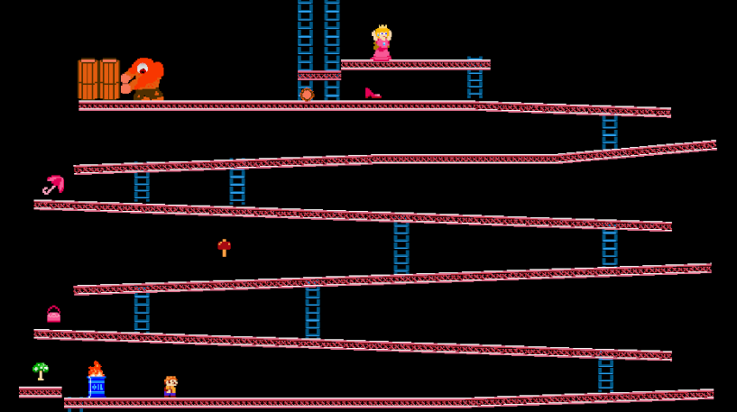
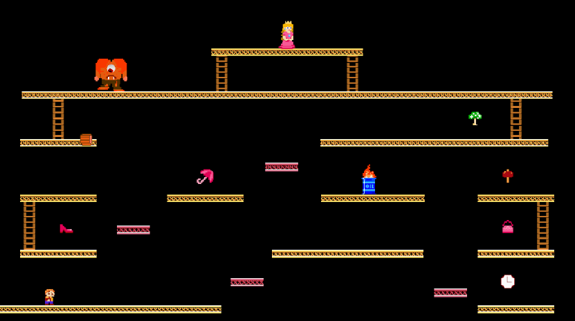
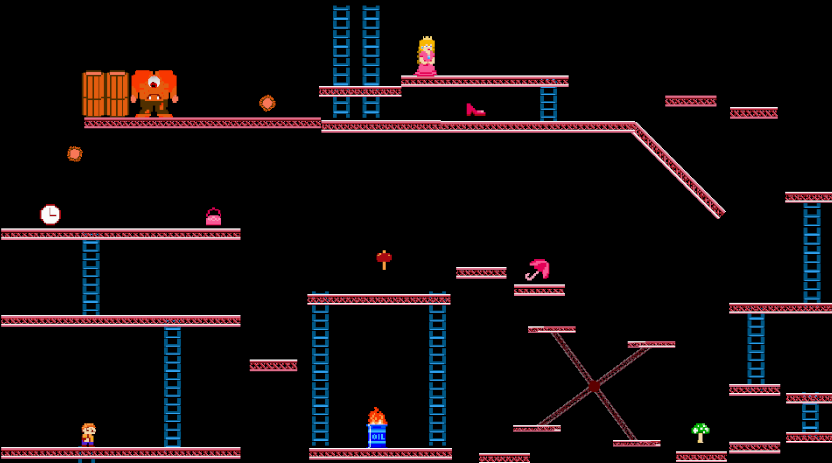
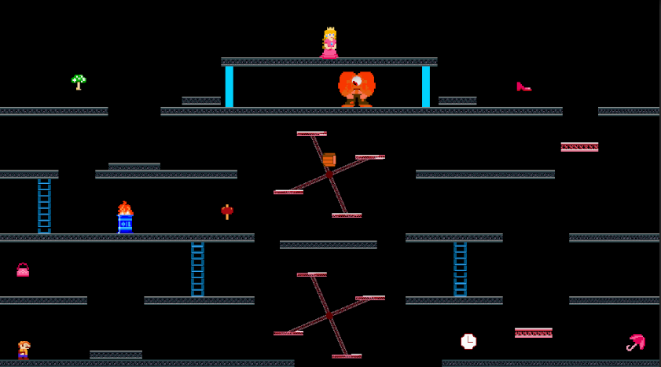

# Man Climbs Tower, Saves Woman that is being held Captive by Feral Animal (MCTSWCFA)
Retro-Jam final project submission for the COSC 416 Unity game development course.

* [Play Here!](https://bhunt02.itch.io/mctswcfa)

## Details
* Based on: Donkey Kong (1981)
* Introduced twist: Time-warp (rewind) mechanic

## Team Members
- Bridgette Hunt
  - Contributions:
    - Level design (modification & finalization), UI design (title screen, victory screen, game over screen, loading screen), sprite design (player, enemies, princess, items), sprite/animation logic, cutscenes, core game logic & loop, time rewind mechanic, hammer powerup, collectible items, points system, lives system, game over system, game progression, refactoring
    - #2, #6, #8, #9, #10, #11, #12, #18, #19, #27, #33
    - https://github.com/anthonyargatoff/MCTSWCFA/pull/21
    - https://github.com/anthonyargatoff/MCTSWCFA/pull/23
    - https://github.com/anthonyargatoff/MCTSWCFA/pull/25
    - https://github.com/anthonyargatoff/MCTSWCFA/pull/34
    - https://github.com/anthonyargatoff/MCTSWCFA/pull/35  
    - https://github.com/anthonyargatoff/MCTSWCFA/pull/40
- Alex Argatoff
-  - Contributions:
    - Player movement, barrel going down ladder interactions, audio and sfx. 
    - Issues: #1, #9, #17
    - https://github.com/anthonyargatoff/MCTSWCFA/pull/20
    - https://github.com/anthonyargatoff/MCTSWCFA/pull/22
    - https://github.com/anthonyargatoff/MCTSWCFA/pull/26
    - https://github.com/anthonyargatoff/MCTSWCFA/pull/28
- Anthony Argatoff
  - Contributions:
    - Level design for 1, 2, 4, and tutorial. Vertical and horizontal barrels. Rotating platforms, up-down platforms.
    - Issues: #3, #15, #36
    - https://github.com/anthonyargatoff/MCTSWCFA/pull/14
    - https://github.com/anthonyargatoff/MCTSWCFA/pull/24
    - https://github.com/anthonyargatoff/MCTSWCFA/pull/37
    - https://github.com/anthonyargatoff/MCTSWCFA/pull/31
- Prateek Balani: 
  - Contribution:
    - Level design: which included disconnected platforms, Up and down platforms, beast throws barrels similar to Lvl 1 and the whole level is ladder dependant.
    - Few debugs
    - Issue: #38
    - https://github.com/anthonyargatoff/MCTSWCFA/pull/39

## Gameplay Footage
* Gameplay:

* Tutorial:
  

* Bonus (Death & Game Over):

## Level Design Images

## Resources

### Designed by Team Members
- Majority of graphics:
  - Player sprites
  - Princess sprites
  - Beast sprites
  - Enemy sprites
  - Collectible item sprites
- All audio assets:
  - Sound effects
  - Music tracks

### External Resources
* General in-game font
  * Public Pixel Font (https://www.ggbot.net/fonts/)
* Tiles for stage elements (ladder, platform)
  * Simple Broad-Purpose Tileset (https://opengameart.org/content/simple-broad-purpose-tileset)
    * Authors: 
      * https://opengameart.org/users/sharm
      * https://opengameart.org/users/surt
      * https://opengameart.org/users/vk
